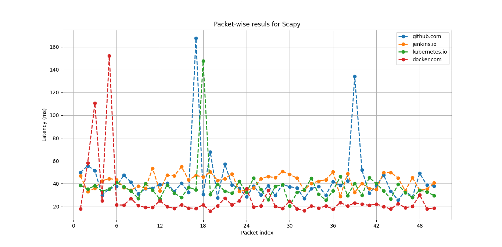

#Packet-Level Latency Measurement


```bash
# Clone this repository
git clone https://github.com/mansnc/latency_analyzer.git
```


- [Introduction](#introduction)
- [Features](#features)
- [Requirements](#requirements)
  - [Verify/Install required packages with Batch/Bash](#verifyinstall-required-packages-with-batchbash)
- [How to run](#how-to-run)
- [Results](#results)
- [Unit Tests](#unit-tests)
- [CI/CD Setup](#cicd-setup)
  - [Jenkins](#jenkins)
  - [Docker](#docker)


## Introduction

This project aim to analyze packet-level latency using combination of python scripting and regular python coding for data processing with two different scenarios: 
- Using standard **ping** interface and sending ICMP sequences. 
- Using **Scapy** library that exploits more advanced tools to manipulate the packets. It can be used to stack different layers of protocols together and it gives comprehensive tools to monitor the network flow along with interesting tools for security purposes. Nevertheless, here scapy is used only for latency measurement purposes. You can refer to [Scapy Documentation](https://scapy.readthedocs.io/en/latest/introduction.html) for more use cases and details. 


## Features
Following options are available when calling conventional **ping** command and **Scapy**

- Number of packets to send 
- IP version (4 or 6)
- Packet Size
- Time to Live (TTL)
- Timeout to receive response
- Transmission Interval

Configuration can be set using [instances.json](instances.json) file. Below is the snapshot of the sample json file: 

```
[
    {"addr": "bing.com", "pkts2send": 1, "pktsize": 64, "ttl": 64, "interval": 2, "IP_v": 4, "timeout": 1},
    {"addr": "github.com", "pkts2send": 1, "pktsize": 64, "ttl": 128, "interval": 1, "IP_v": 4, "timeout": 2},
    {"addr": "google.com", "pkts2send": 1, "pktsize": 128, "ttl": 64, "interval": 1, "IP_v": 4, "timeout": 3}
]
```
While this json file is designed for [main.py](main.py) in which it calls both modules, namely [module_ping_measure_latency.py](module_ping_measure_latency.py) and [module_scapy_measure_latency.py](module_ping_measure_latency.py), however, each module has its own script and those instances can be modified within those scripts separately.   


## Requirements

This project requires the following packages to be installed before running. Assuming "pip" is already installed, execute the following commands in CMD/powershell on windows or in Bash of Linux/MacOS  

```
pip install scapy
pip install statistics
pip install matplotlib
```
### Verify/Install required packages with Batch/Bash
Simply execute [check_packages_windows.bat](check_packages_windows.bat) if you are on windows machine and [check_packages_unix_mac.sh](check_packages_unix_mac.sh) if you are on a unix-based (Linux/MacOS) machine by excuting the following commands in project's root:
```
chmod +x check_packages_unix_mac.sh
./check_packages_unix_mac.sh
``` 
Those batch/bash scripts will make sure pip is installed on your machine and it will use appropriate version of the pip (pip/pip3) coressponding the version of python installation; namely, python or python3, espectively, associated with pip and pip3.  

## How to run

You can either run each module separately as follows:

- For ping: [main_run_ping.py](main_run_ping.py)
- For Scapy: [main_run_scapy.py](main_run_scapy.py)

Or run [main.py](main.py) that lunches both modules sequentially and generates results for each module. 


## Results
Results are visualized for given queries in json file and here is the snapshop of some experiments. 
The following results demonstrates latency per each packet when using Scapy tools. Since ping command doesn't provide ways to track a specific packet, packet-wise results for ping command is not included in this graph. Nevetheless, if there is no packet loss in the ping command, once can easily plot the ping results as well. 




Below is the summary of the latency w.r.t four target hosts. As can be seen, Scapy latencies are slightly different from the ping counterpart and here are the reasons: 

**Overhead:** When we use Scapy to send packets, there's an overhead associated with the Python interpreter, the Scapy library, and the system calls it makes. This overhead can introduce slight delays in packet transmission and reception. On the other hand, the ping command, which typically uses the ICMP protocol, is a lightweight, native tool optimized for its purpose. This means that, in some cases, Scapy might report slightly higher latencies than ping.

**Packet Construction:** Scapy gives the ability to craft custom packets, which means you have control over the packet's size, headers, and other attributes. The size and structure of the packet can influence the time it takes for the packet to be processed by intermediate devices and the target host. If you're sending a packet with Scapy that's larger or more complex than a standard ICMP echo request (used by ping), it might take longer to process, leading to higher reported latencies.

**Response Handling:** The way each tool handles responses can also differ. Scapy might take slightly longer to process incoming packets due to its Python-based nature, while ping is optimized for quick response handling.


## Unit Tests
Two simple unit tests are designed to check the functionality of the latency measurement modules, namely [module_ping_measure_latency.py](module_ping_measure_latency.py) and [module_scapy_measure_latency.py](module_ping_measure_latency.py). Sicne we are expecting measurement modules to return latency for target hosts, test units will check whether the returned results from these modules are i) not null and ii) a number greater equal than 0. To run test units simply execute the following files in Python: 
- For Ping: run [unittest_measure_latency_ping.py](unittest_measure_latency_ping.py)
- For Scapy: run [unittest_measure_latency_scapy.py](unittest_measure_latency_scapy.py)

## CI/CD Setup
This project has CI/CD methodologies integrated within utilizing tools from Jenkins and Docker. I've utilize Jenkins to continuesly monitor my branches status whenever I made a commit on those branches. In what follows, I'll provide step-by-step guide how to setup Jenkins and Docker on your local machine to monitor the status of the branches in case one wants to add new features to this project. 
### Jenkins
### Docker

